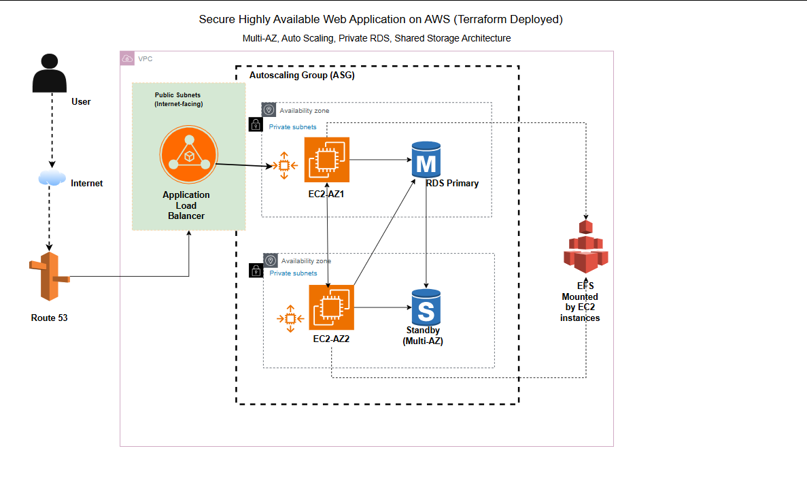

# Secure Highly Available Web Application on AWS (Terraform Deployed)
## Overview

This project demonstrates how to design and deploy a secure, highly available web application architecture on AWS using Terraform as Infrastructure as Code.

The solution is built following AWS Well-Architected reliability and security best practices. The infrastructure is distributed across multiple Availability Zones to ensure fault tolerance, automatic recovery, and scalability.

User traffic flows through Route 53 (optional) to an internet-facing Application Load Balancer located in public subnets. The load balancer distributes requests to EC2 instances running in private subnets and managed by an Auto Scaling Group. The application stores data in a Multi-AZ PostgreSQL RDS instance with automatic failover. Amazon EFS provides shared storage across instances to support horizontal scaling and consistent file access.

This project simulates a production-grade environment and showcases real-world cloud architecture design using Terraform.

# Architecture Highlights

- Multi-AZ deployment for high availability
- Auto Scaling Group for self-healing compute layer
- Application Load Balancer for traffic distribution
- PostgreSQL RDS with Multi-AZ failover
- Amazon EFS for shared storage
- Secure VPC with public and private subnets
- IAM roles and SSM access instead of SSH
- Optional Route 53 integration for DNS routing
- S3 bucket for static asset storage

# Architecture Flow
1. A user sends a request through the browser.
2. Traffic is routed to the Application Load Balancer in public subnets.
3. The ALB distributes traffic to EC2 instances in private subnets.
4. EC2 instances serve the web application and mount EFS for shared storage.
5. The application reads and writes data to PostgreSQL RDS in private DB subnets.
6. Auto Scaling replaces unhealthy instances automatically.
7. Multi-AZ RDS ensures database failover resilience.

# Project Objective

The objective of this project is to design and implement a resilient cloud infrastructure that eliminates single points of failure. Traditional single-server deployments can result in downtime if an instance or database fails. This architecture demonstrates how to build a self-healing, scalable, and secure environment using AWS managed services and Terraform.

This project reflects the responsibilities of a Solutions Architect focused on reliability engineering and infrastructure automation.

# Technologies Used
- Terraform
- Amazon VPC
- Amazo EC2
- Auto Scaling Group
- Application Load Balancer
- Amazon RDS (PostgreSQL, Multi-AZ)
- Amazon EFS
- Amazon S3
- AWS IAM
- AWS Systems Manager (SSM)
- Amazon Route 53 (optional)

# Folder Structure
```
├── asg.tf
├── alb.tf
├── efs.tf
├── iam.tf
├── rds.tf
├── s3.tf
├── vpc.tf
├── security-groups.tf
├── variables.tf
├── terraform.tfvars.example
├── outputs.tf
├── web/
│   ├── index.html
│   └── style.css
└── README.md
```
# Deployment Instructions

## 1) Clone the repository
```
git clone <repo-url>
cd <repo-folder>
```
## 2) Create your variables file
```
cp terraform.tfvars.example terraform.tfvars
````
## Update
```
db_password = "your-secure-password"
```
## 3) Initialize Terraform
```
terraform init
```
## 4) Plan deployment
```
terraform plan
```
## 5) Deploy infrastructure
```
terraform apply
```
### 6) Access the application
After deployment, Terraform outputs:
```
alb_dns_name
```
Open this URL in your browser.

## Architecture Overview


# High Availability Features Demonstrated
This project showcases real reliability engineering patterns:

- Multi-AZ EC2 deployment
- Load balanced traffic distribution
- Automatic instance replacement via ASG
- Database failover using Multi-AZ RDS
- Stateless web tier with shared EFS storage
- Private subnet isolation for compute and database layers

# Security Best Practices

- No public EC2 access
- Instances run in private subnets
- Security groups enforce least privilege
- RDS is not publicly accessible
- SSM replaces SSH access
- Secrets kept out of source control

# How to Test Resilience
You can simulate failures to validate high availability:
- Terminate an EC2 instance → ASG automatically replaces it
- Stop one instance → ALB routes traffic to healthy instances
- RDS Multi-AZ failover handled automatically by AWS

# Route 53 Note

Route 53 is included as optional infrastructure. It is disabled by default to allow deployment in accounts without DNS configuration.

To enable:
```
enable_route53 = true
domain_name    = "yourdomain.com"
hosted_zone_id = "ZXXXXXXXX"
```

# Future Enhancements

- Possible extensions:
- HTTPS with ACM
- WAF integration
- CI/CD pipeline
- Blue/Green deployments
- CloudWatch monitoring dashboards
- entralized logging

  